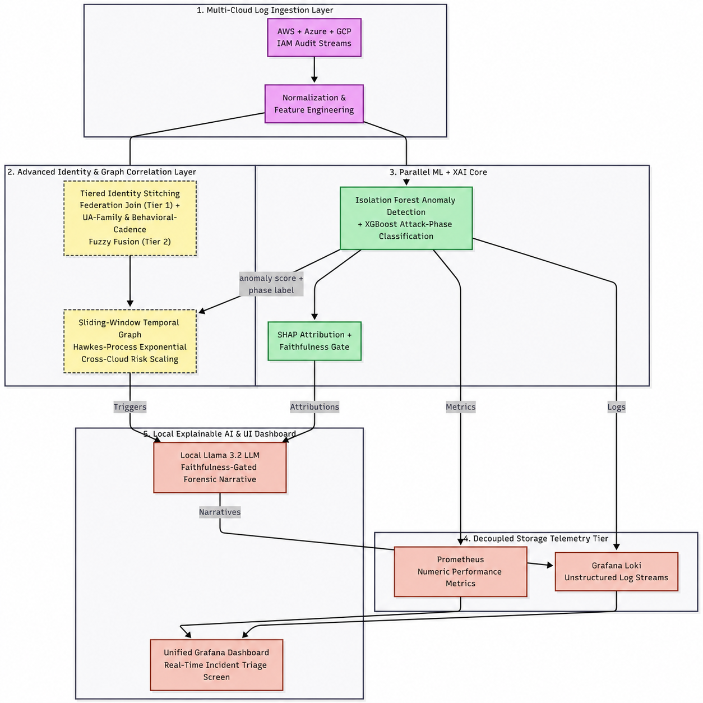

<a name="top"></a>

<h1>CloudSentinel-XAI</h1>

<p>
  AI-Driven Zero-Trust Security Framework for Explainable Threat Detection in Multi-Cloud Environments
</p>

<p align="center">

[](https://www.python.org/)
[](https://fastapi.tiangolo.com/)
[](#ai-and-ml-approach)
[](https://grafana.com/)
[](https://prometheus.io/)
[](https://grafana.com/oss/loki/)
[](https://sqlite.org/)
[](https://shap.readthedocs.io/)
[](https://scikit-learn.org/)
[](https://docs.pydantic.dev/)

</p>

---

CloudSentinel-XAI combines machine learning, graph correlation, explainable AI, and a local Large Language Model to detect sophisticated cyber attacks across AWS, Azure, and GCP audit logs while providing faithful, analyst-friendly explanations in real time.

---

# 📑 Table of Contents

- [🚀 About](#-about)
- [✨ Features](#-features)
- [🏗️ System Architecture](#️-system-architecture)
- [🛠️ Tech Stack](#️-tech-stack)
- [📂 Project Structure](#-project-structure)
- [⚙️ Installation](#️-installation)
- [🚀 Running the Project](#-running-the-project)
- [📊 Dashboard](#-dashboard)
- [📖 Documentation](#-documentation)
- [📜 License](#-license)

---

# 🚀 About

CloudSentinel-XAI is a high-throughput, multi-cloud Zero-Trust security framework that ingests cloud audit logs, detects sophisticated attacks using parallel machine learning models, estimates evolving risk using mathematical point processes, and generates faithful forensic explanations through a hallucination-resistant local Large Language Model.

The framework is designed for Security Operations Centers (SOCs) and cloud security teams requiring interpretable, real-time threat detection without sacrificing detection accuracy.

---

# ✨ Features

- 🔍 Multi-cloud audit log ingestion (AWS, Azure, GCP)
- ⚡ High-speed log normalization pipeline
- 🧠 Parallel ML inference for anomaly detection
- 📈 Dynamic risk acceleration scoring
- 🌐 Identity and graph-based attack correlation
- 🎯 MITRE ATT&CK tactic prediction
- 📊 SHAP-based explainable AI
- 🤖 Faithfulness-gated local LLM explanations
- 📡 Prometheus metrics integration
- 📝 Loki centralized log storage
- 📈 Grafana real-time dashboards
- 💾 SQLite-backed alert persistence

---

# 🏗️ System Architecture

<p align="center">
    
</p>

---

# 🛠️ Tech Stack

| Category | Technologies |
|----------|--------------|
| Backend | FastAPI, Pydantic |
| Machine Learning | XGBoost, Isolation Forest, Scikit-learn |
| Explainability | SHAP |
| Database | SQLite |
| Monitoring | Prometheus |
| Logging | Grafana Loki |
| Visualization | Grafana |
| Programming Language | Python 3.12 |

---

# 📂 Project Structure

```text
CloudSentinel-XAI/
│
├── app/
│   ├── api/
│   ├── services/
│   ├── parser_normalizer/
│   ├── core/
│   ├── models/
│   └── main.py
│
├── assets/
│   └── Architecture.png
│
├── docs/
│
├── requirements.txt
├── README.md
└── LICENSE
```

---

# ⚙️ Installation

Clone the repository

```bash
git clone https://github.com/<your-username>/CloudSentinel-XAI.git
```

Navigate to the project

```bash
cd CloudSentinel-XAI
```

Create a virtual environment

```bash
python -m venv .venv
```

Activate it

Windows

```powershell
.venv\Scripts\activate
```

Linux/macOS

```bash
source .venv/bin/activate
```

Install dependencies

```bash
pip install -r requirements.txt
```

---

# 🚀 Running the Project

Start the FastAPI server

```bash
uvicorn app.main:app --reload
```

The API will be available at

```
http://127.0.0.1:8000
```

Interactive API Documentation

```
http://127.0.0.1:8000/docs
```

---

# 📊 Dashboard

Grafana dashboards provide:

- Real-time incident monitoring
- Threat severity visualization
- MITRE ATT&CK mapping
- Risk acceleration trends
- XAI explanations
- Alert timelines

> Dashboard screenshots will be added soon.

---

# 📖 Documentation

Detailed documentation is currently under development.

Planned documentation includes:

- API Reference
- Threat Detection Pipeline
- Data Normalization
- Machine Learning Models
- Explainable AI Pipeline
- Dashboard Configuration
- Deployment Guide

---

# 📜 License

---

<p align="center">
Developed as part of the <b>CloudSentinel-XAI CCNCS Research Project</b>.
</p>

<p align="center">
<a href="#top">⬆ Back to Top</a>
</p>
