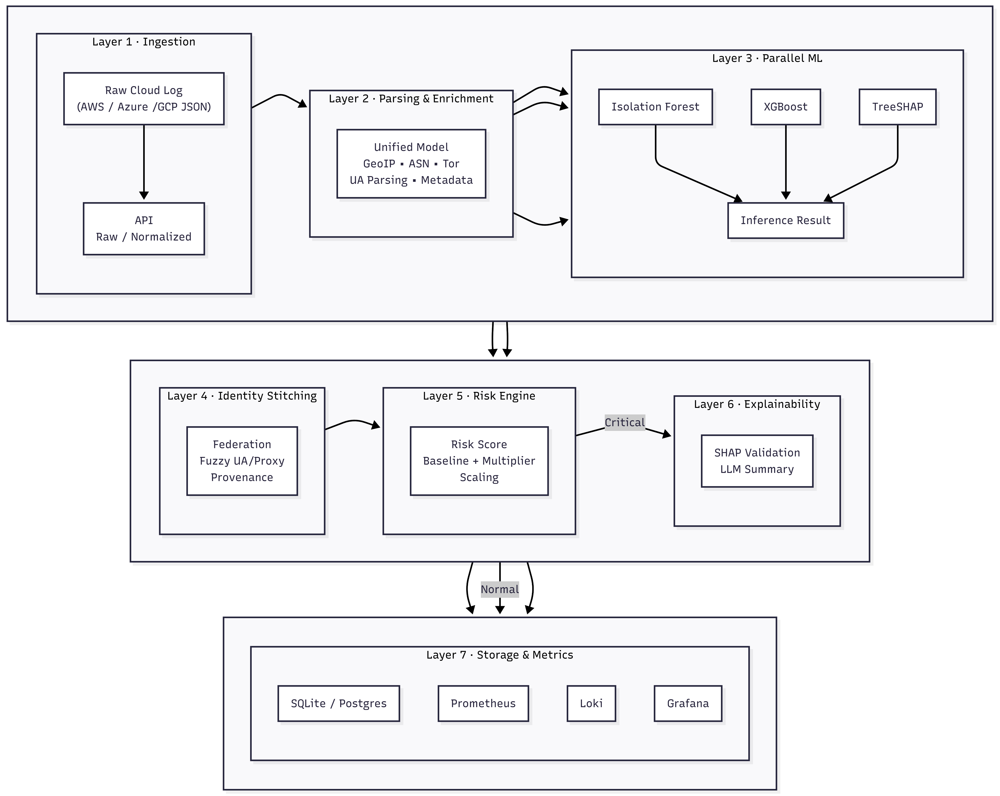
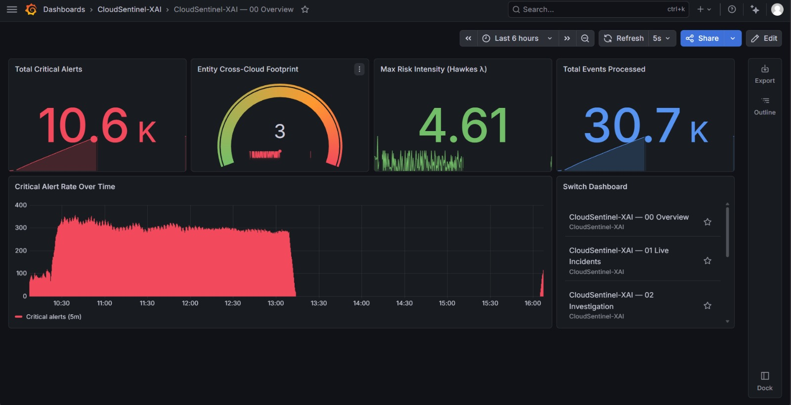
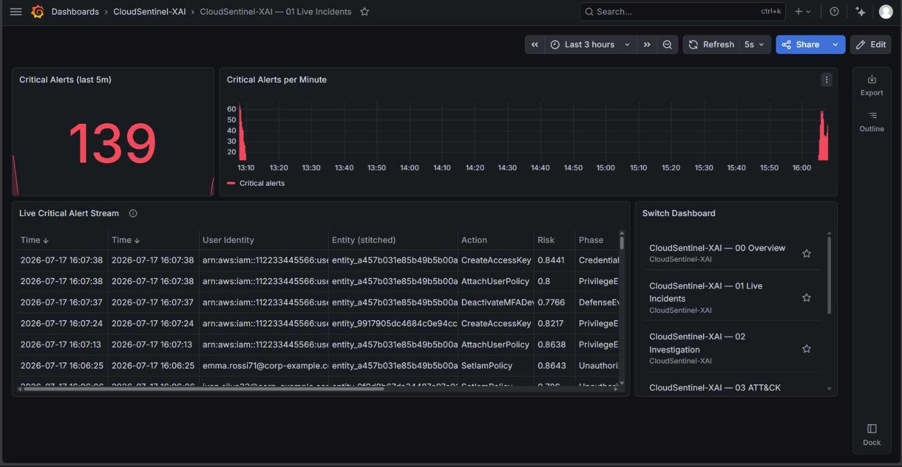
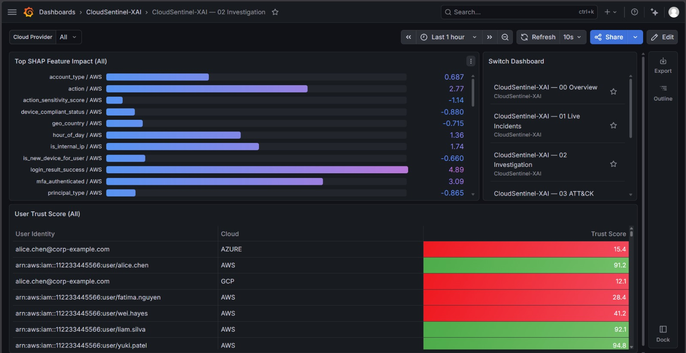
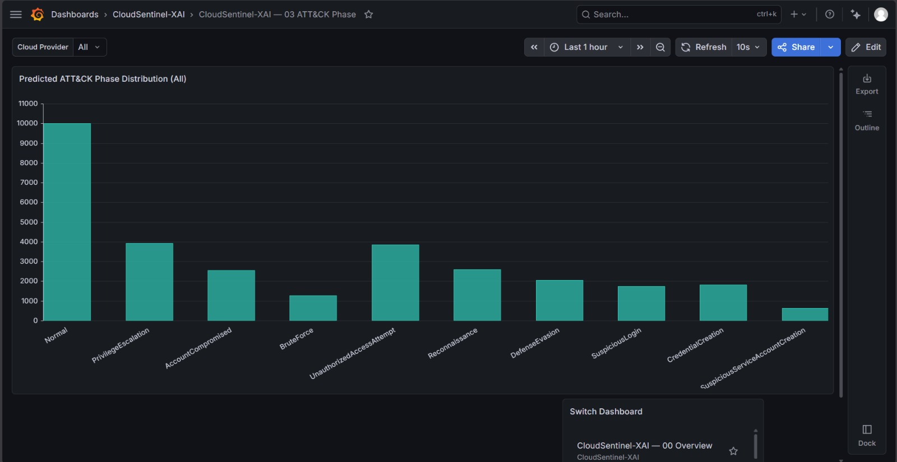
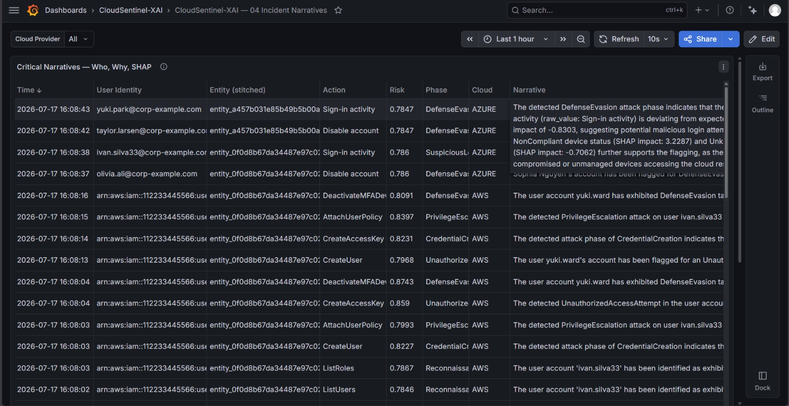
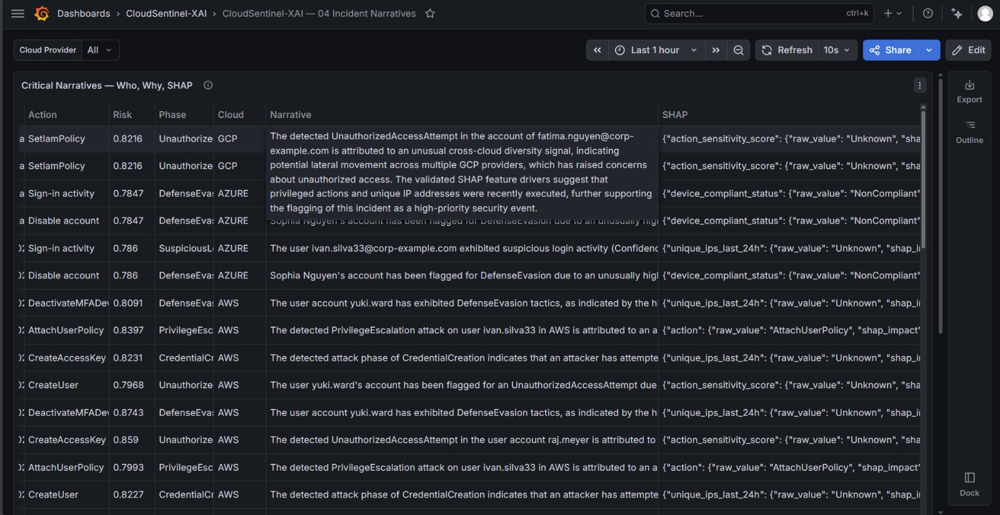
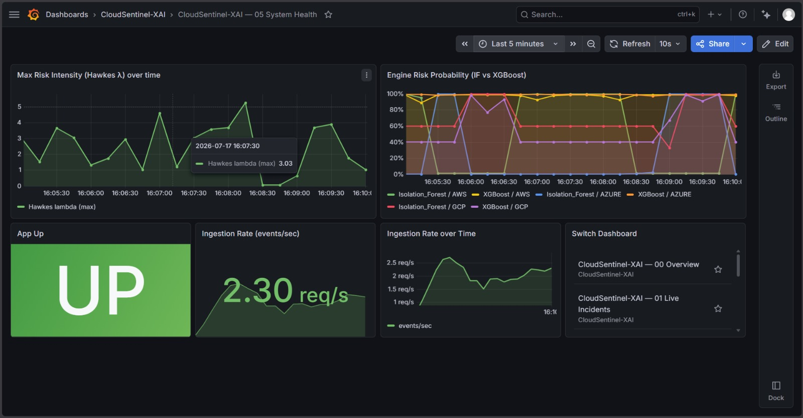

# CloudSentinel-XAI

**AI-Driven Zero-Trust Security Framework for Explainable Threat Detection in Multi-Cloud Environments**

[](https://www.python.org/)
[](https://fastapi.tiangolo.com/)
[](#model-performance)
[](https://shap.readthedocs.io/)
[](https://grafana.com/)
[](https://prometheus.io/)
[](https://grafana.com/oss/loki/)
[](https://sqlite.org/)
[](https://docs.pydantic.dev/)
[](#license)

---

CloudSentinel-XAI ingests **AWS CloudTrail**, **Azure AD Audit / Sign-in**, and **GCP Cloud Audit** logs, stitches identity across clouds, scores risk in real time with parallel ML models, and explains every critical alert with SHAP-attributed, faithfulness-gated narratives from a local LLM. It is built for SOC analysts who need to trust an explanation, not just receive one, and it ships with a full observability stack (Prometheus, Loki, Grafana) so detections are visible the moment they happen.

---

## Table of Contents

- [🧭 Overview](#overview)
- [🎯 Why CloudSentinel-XAI](#why-cloudsentinel-xai)
- [✨ Key Features](#key-features)
- [🏗️ System Architecture](#system-architecture)
- [⚙️ How It Works](#how-it-works)
- [🛠️ Tech Stack](#tech-stack)
- [📂 Project Structure](#project-structure)
- [🔧 One-Time Setup](#one-time-setup)
- [🚀 Running the Full Stack](#running-the-full-stack)
- [📡 API Reference](#api-reference)
- [📊 Grafana Dashboards](#grafana-dashboards)
- [🧪 Synthetic Dataset Generator](#synthetic-dataset-generator)
- [📈 Model Performance](#model-performance)
- [✅ Testing](#testing)
- [🩺 Troubleshooting](#troubleshooting)
- [🗺️ Project Status & Roadmap](#project-status--roadmap)
- [🤝 Contributing](#contributing)
- [📄 License](#license)

---

## 🧭 Overview

CloudSentinel-XAI is a high-throughput, multi-cloud Zero-Trust security framework that:

1. **Ingests** raw or pre-normalized audit logs from AWS, Azure, and GCP into a single common event schema.
2. **Stitches identity** across clouds using a tiered correlation model (federation join → creation provenance → fuzzy fusion), so the same human or service account is tracked as one entity even when cloud-native identifiers don't line up.
3. **Scores risk** in parallel using an unsupervised anomaly detector (Isolation Forest) and a supervised ATT&CK-phase classifier (XGBoost), combined into a time-decayed, cross-cloud-aware risk score.
4. **Explains** every critical alert through TreeSHAP feature attribution, gated by a faithfulness test (a SHAP deletion test) so a local LLM only narrates explanations that are provably grounded in the model's own behavior, not hallucinated.
5. **Surfaces** everything through Prometheus metrics, Loki-backed logs, and six purpose-built Grafana dashboards for real-time SOC visibility.

It is designed for Security Operations Centers (SOCs) and cloud security teams that need interpretable, real-time, cross-cloud threat detection without sacrificing detection accuracy, and without asking analysts to trust a black box.

---

## 🎯 Why CloudSentinel-XAI

Most cloud-native detection tools operate per-cloud and treat explanation as an afterthought. CloudSentinel-XAI is built around three specific, deliberately engineered ideas:

- **Pace-independent cross-cloud detection.** Identity and an entity's lifetime cloud footprint are tracked independently of the live risk-scoring window, so a low-and-slow attacker pacing steps minutes apart across AWS → Azure → GCP is still caught, not just an attacker who moves fast.
- **Faithfulness-gated explanations.** SHAP attributions are only allowed to reach the LLM narrator after passing a deletion test: zeroing the top-attributed features and confirming the model's confidence actually drops. If it doesn't, the alert is flagged for manual analyst review instead of generating a plausible-sounding but unfaithful story.
- **Leakage-safe synthetic evaluation.** The included dataset generator deliberately avoids the most common synthetic-IAM-dataset flaw (identity as a label giveaway) by compromising randomly drawn *legitimate* users and holding out a generalization split, so the reported detection numbers mean something.

The project is also transparent about where it is still weak — see [Model Performance](#model-performance) for the honest current numbers, including a known blind spot on insider-privilege-abuse scenarios.

---

## ✨ Key Features

- Multi-cloud audit log ingestion (AWS CloudTrail, Azure AD Audit/Sign-in, GCP Cloud Audit Logs), raw or pre-normalized
- High-speed, schema-unifying log normalization pipeline with GeoIP/ASN and Tor exit-node enrichment
- Tiered, cross-cloud identity stitching (federation join → creation provenance → fuzzy fusion with an ambiguity guard against over-merging)
- Parallel ML inference: Isolation Forest anomaly scoring + XGBoost MITRE ATT&CK phase classification, dispatched concurrently via `asyncio.to_thread`
- Time-decayed, cross-cloud-diversity-aware risk scoring (Hawkes-style intensity) with automation-vs-human sensitivity
- SHAP-based explainable AI with per-alert top feature attribution
- Faithfulness-gated local LLM narratives (Llama 3.2 via Ollama), no narrative without a passing deletion test
- Leakage-safe, MITRE ATT&CK-annotated synthetic multi-cloud dataset generator for training and evaluation
- Prometheus metrics, Loki centralized logging, and six linked Grafana dashboards covering overview KPIs, live incidents, investigation, ATT&CK phase distribution, full narrative/SHAP detail, and system health
- SQLite-backed alert and risk-state persistence with write-coalescing background flush
- Graceful bypass mode: the entire pipeline runs end-to-end with neutral defaults even before trained models exist, so the system is never a single missing artifact away from crashing
- A one-command dashboard deployer (`grafana/deploy_dashboards.py`) that auto-detects the local Grafana instance's real datasource UIDs, so the same dashboard JSON works unmodified on any machine
- A traffic-generation script (`feed_ingest.py`) that replays generated attack datasets through the live API to drive the dashboards end-to-end without a real cloud environment

---

## 🏗️ System Architecture



At a glance, telemetry flows through five layers:

| Layer | Responsibility |
|---|---|
| Multi-Cloud Control Plane | AWS CloudTrail, Azure AD Audit, GCP Cloud Audit Logs ingestion |
| Normalization Layer | Common event schema (actor, action, resource, timestamp, source signals) |
| Feature Engineering | Lexical, identity-context, network-context, and behavioral features |
| ML + XAI Inference | Isolation Forest + XGBoost, TreeSHAP attribution, faithfulness gate |
| Identity Stitching + Risk Scoring | Tiered cross-cloud correlation, time-decayed cross-cloud risk score |
| Forensic Dashboard | Faithfulness-gated LLM narrative, Loki/Prometheus/Grafana |

---

## ⚙️ How It Works

1. **Ingest** — `POST /api/v1/ingest/raw` accepts raw provider JSON (AWS/Azure/GCP, auto-detected per record) and normalizes it through the parser pipeline first. `POST /api/v1/ingest` accepts records that are already in the normalized `UnifiedLogModel` shape.
2. **Enrich & Normalize** — Each event is parsed into a `UnifiedLogModel`, enriched with GeoLite2 ASN/country lookups and Tor exit-node matching, and reduced to a shared feature set.
3. **Identity Resolution** — `MultiCloudGraphEngine` resolves the event to a persistent entity via federation join → creation-provenance lookup → fuzzy fusion (UA family/version, proxy/Tor alignment, principal type, capped IP match with an ambiguity margin) and maintains both a live sliding window and a permanent lifetime cloud footprint per entity.
4. **Parallel ML Inference** — `ParallelMLEngine` concurrently runs Isolation Forest (anomaly score) and XGBoost (ATT&CK phase + TreeSHAP attribution) via `asyncio.to_thread`.
5. **Risk Scoring** — `RiskEngine` combines a time-decayed sum of anomaly scores with a cross-cloud diversity multiplier, driven by the entity's lifetime cloud footprint (not just the live window), and distinguishes automation from human principals.
6. **Faithfulness Gate + Narrative** — On a critical alert, `FaithfulnessGatedXAI` re-runs the model with the top-SHAP features zeroed out; only if confidence drops enough does it prompt a local Llama 3.2 model (via Ollama) for a two-sentence tactical narrative, with the raw telemetry explicitly delimited to reduce prompt-injection risk.
7. **Persistence & Observability** — Risk state is write-coalesced into SQLite, narratives are pushed to Loki, and Prometheus metrics feed six Grafana dashboards for live SOC monitoring.
8. **Bypass Mode** — If no trained model artifacts are found under `models/`, every stage above still runs, returning well-formed neutral defaults instead of failing, so the service is deployable and testable before training is complete.

---

## 🛠️ Tech Stack

| Category | Technologies |
|---|---|
| Backend / API | FastAPI, Pydantic, Uvicorn |
| Machine Learning | XGBoost, Isolation Forest, scikit-learn |
| Explainability | SHAP (TreeExplainer + deletion-test faithfulness gate) |
| LLM Narration | Llama 3.2 via Ollama (local inference) |
| Database | SQLite (async, via SQLAlchemy) |
| Monitoring | Prometheus |
| Logging | Grafana Loki |
| Visualization | Grafana |
| Enrichment | MaxMind GeoLite2 (ASN + Country), Tor exit-node list |
| Language | Python 3.12 |

---

## 📂 Project Structure

```
CloudSentinel-XAI/
│
├── app/
│   ├── core/                    # Database engine/session setup
│   ├── parser_normalizer/       # AWS / Azure / GCP parsers, enrichment, feature extraction
│   │   ├── mock_data/           # Sample raw logs per cloud + a unified sample stream
│   │   ├── reference_data/      # GeoLite2 DBs, Tor exit-node list
│   │   └── src/                 # ParserPipeline, normalizer, schema, feature_extractor
│   ├── routers/                 # ingest.py: POST /api/v1/ingest and /api/v1/ingest/raw
│   ├── services/                # graph_engine, risk_engine, ml_inference, xai_engine,
│   │                             # xai_triage, db_flusher, metrics_exporter, loki_exporter
│   └── main.py                  # FastAPI app, lifespan, engine bootstrap, bypass-mode logic
│
├── dataset_script/               # Leakage-safe synthetic multi-cloud dataset generator
│   ├── env_profile.py            # Procedural, seeded, label-neutral organization/population
│   ├── emitters.py                # Emits records in exact AWS/Azure/GCP schemas
│   ├── generate_benign.py         # Benign baseline traffic
│   ├── attack_scenarios.py        # MITRE ATT&CK cross-cloud kill chains
│   ├── generate_attacks.py        # Renders attacks on randomly-drawn legitimate victims
│   ├── check_leakage.py           # Asserts no identity is a label giveaway
│   ├── validate_realism.py        # Synthetic-vs-real statistical fidelity report
│   └── build_dataset.py           # One command -> full labelled corpus
│
├── models/                       # Training, validation, and evaluation for both models
│   ├── train_isolation_forest.py  # Trains the benign-only anomaly detector
│   ├── validate_and_pick_threshold.py  # Picks the decision threshold, adds it to the bundle
│   ├── train_xgboost.py           # Trains the supervised ATT&CK-phase classifier
│   ├── evaluate_full_pipeline.py  # Ablation study across IF/XGBoost x graph on/off/oracle
│   ├── evaluate_loso.py           # Leave-one-scenario-out generalization evaluation
│   ├── audit_entity_purity.py     # Identity-stitching purity diagnostics
│   ├── ablation_results.csv       # Latest ablation study output
│   ├── loso_results.csv           # Latest LOSO evaluation output
│   └── README.md                  # Dataset split roles, pipeline diagram, reproduction steps
│
├── grafana/
│   ├── dashboards/                # 6 dashboard JSON files (00 Overview .. 05 System Health)
│   └── deploy_dashboards.py       # Pushes all dashboards to a running Grafana via its HTTP API
│
├── demo/                          # Stage-by-stage demo scripts (parser -> feature -> graph ->
│                                   # ML -> risk -> XAI -> persistence)
├── tests/                         # pytest suite (end-to-end + unit, runs in bypass mode)
├── assets/
│   └── Architecture.png
│
├── feed_ingest.py                 # Replays a generated attack split through /api/v1/ingest/raw,
│                                   # once or in a loop, to drive the dashboards with live traffic
├── loki-config.yaml                # Loki configuration
├── prometheus.yml                  # Prometheus scrape configuration
├── requirements.txt
└── README.md
```

Not part of the active pipeline, kept for reference: `demo_simulator.py` (emits fabricated metrics to exercise dashboard layout with no live traffic — never run alongside real traffic), `benchmark_llm_models.py` and `test_llm.py` (standalone LLM latency/output experiments).

---

## 🔧 One-Time Setup

Run every command from the repository root. Commands are shown for Windows/PowerShell; on macOS/Linux use `.venv/bin/activate` instead of `.venv\Scripts\activate` and drop the `.exe` suffixes.

### 1. Python environment

```bash
python -m venv .venv

# Windows
.venv\Scripts\activate
# macOS / Linux
source .venv/bin/activate

pip install -r requirements.txt
```

### 2. Install Prometheus, Loki, and Grafana

None of these ship with the repository; they are separate binaries/services installed once per machine.

- **Prometheus** — download from [prometheus.io](https://prometheus.io/download/) (a Windows zip is available). Unzip it anywhere; you will reference `prometheus.exe` by path when starting it.
- **Loki** — download a `loki-<platform>-amd64` binary from [Grafana's Loki releases](https://grafana.com/docs/loki/latest/setup/install/). No install step; it is a standalone binary.
- **Grafana** — download the installer/zip from [grafana.com](https://grafana.com/grafana/download). Once installed it runs as a background service (check with `Get-Service Grafana` on Windows, or `systemctl status grafana-server` on Linux) and listens on port 3000; you do not start it manually the way you do Prometheus and Loki.

Pick a folder for the Prometheus and Loki executables and remember it; you will pass its path when starting them (see [Running the Full Stack](#running-the-full-stack)).

### 3. Point Grafana at Prometheus and Loki

Open `http://127.0.0.1:3000` (default login `admin` / `admin`; you will be asked to change the password on first login). Go to **Connections → Data sources → Add data source** and add:

- **Prometheus**, URL `http://127.0.0.1:9090`
- **Loki**, URL `http://127.0.0.1:3100`

This step matters even before Prometheus/Loki themselves are running: `grafana/deploy_dashboards.py` (see below) needs both data sources to already exist in Grafana, and refuses to deploy with a clear error otherwise.

### 4. (Optional) Install Ollama for real LLM narratives

The faithfulness-gated SOC narrative feature calls a local LLM via [Ollama](https://ollama.com/). Without it, everything else in the pipeline still works; narrative generation just fails gracefully (logged, not crashed) and the dashboards fall back to a structured summary line instead of an LLM-written one.

```bash
ollama pull llama3.2
```

### 5. (Optional) Generate the dataset and train both models

Out of the box, with no trained models present, the app runs in **bypass mode**: every event gets neutral placeholder scores (`anomaly_score=0.1`, phase `"Normal"`, no SHAP) so the full ingest → normalize → graph → risk → dashboard pipeline is exercisable immediately after cloning. That is fine for a first look at the dashboards; it is not useful for seeing real detections.

For real scoring, generate the synthetic dataset and train both models. `Datasets/` and every `*.pkl` are gitignored, so a fresh clone always starts without them:

```bash
cd dataset_script
python generate_benign.py  --days 21 --seed 42 --split train   --out ../Datasets/Train_iso
python generate_benign.py  --days 21 --seed 42 --split holdout --out ../Datasets/holdout
python generate_attacks.py --seed 7  --env-seed 42 --pace fast --noise-ratio 0.4 --repeats 8 --days 21 --out ../Datasets/attacks_fast
python generate_attacks.py --seed 13 --env-seed 42 --pace slow --noise-ratio 0.4 --repeats 8 --days 21 --out ../Datasets/attacks_slow
cd ..

python models/train_isolation_forest.py --train-dir Datasets/Train_iso --out models
python models/validate_and_pick_threshold.py --model models/iso_forest.pkl --holdout-dir Datasets/holdout --attack-dir Datasets/attacks_fast
python models/train_xgboost.py --train-dir Datasets/attacks_fast --test-dir Datasets/attacks_slow --out models
```

`train_xgboost.py` defaults to `--device cuda`; pass `--device cpu` if there is no GPU. See `models/README.md` for the full split structure, what each script does, and how to reproduce the numbers in [Model Performance](#model-performance).

---

## 🚀 Running the Full Stack

The application, Prometheus, Loki, and the demo traffic feed are four independent long-running processes. Start them in this order, in separate terminals, confirming each is healthy before starting the next.

### Terminal 1 — Prometheus

```bash
<path-to-prometheus>/prometheus.exe --config.file="prometheus.yml" --storage.tsdb.path="data/prometheus" --web.listen-address=:9090
```

Prometheus starts scraping `http://localhost:8000/metrics` every 5 seconds (per `prometheus.yml`) and has nothing to scrape until the app (Terminal 3) is up. Check `http://127.0.0.1:9090/targets`: the `cloudsentinel-app` target should read **UP** once the app is running.

### Terminal 2 — Loki

```bash
<path-to-loki>/loki-<platform>-amd64 -config.file="loki-config.yaml"
```

Loki listens on port 3100 for pushed log lines. The app pushes one line per critical alert (the SOC narrative plus SHAP attribution) directly to it; there is no scrape step.

### Terminal 3 — the application

```bash
.venv\Scripts\activate
uvicorn app.main:app --host 127.0.0.1 --port 8000
```

FastAPI starts up, creates SQLite tables if missing, and tries to load `models/iso_forest.pkl` and `models/xgboost_classifier.pkl`. If both load, scoring is real (`ml_bypass: false`). If either is missing, the app falls back to bypass mode automatically; it never crashes for a missing model.

Confirm it is healthy:

```bash
curl http://127.0.0.1:8000/health
```

Expect `{"status":"ONLINE","engine":"cloud sentinel","ml_bypass":false,"known_entities":N}`.

### Terminal 4 — feed loop (drives demo traffic through the pipeline)

```bash
.venv\Scripts\activate
python feed_ingest.py --loop --interval 60
```

Every 60 seconds this posts the raw AWS/Azure/GCP attack logs from `Datasets/attacks_slow/*_attack.json` to `POST /api/v1/ingest/raw`. Each event is then normalized, scored (anomaly score + ATT&CK phase + SHAP), identity-stitched across clouds, risk-scored, and, on a critical alert, narrated via the faithfulness-gated LLM path, with metrics and logs flowing to Prometheus and Loki respectively.

This needs `Datasets/attacks_slow` to exist (see setup step 5). Without a generated dataset, you can still exercise ingestion manually with the small sample already checked into the repo:

```bash
curl -X POST http://127.0.0.1:8000/api/v1/ingest/raw -H "Content-Type: application/json" -d "@app/parser_normalizer/mock_data/unified_datastream.json"
```

**On the `--interval` choice:** each pass processes roughly 370 events, and critical alerts trigger an LLM call. Every ingested event is currently processed strictly sequentially inside one background-task chain, by design, because the identity graph and risk engines depend on seeing a given principal's events in temporal order. At a short interval (for example 5 seconds), new batches can arrive faster than the pipeline drains them, the backlog grows, `/metrics` responses slow down, and Prometheus's scrape can time out, blanking every dashboard panel. A 60-second interval gives each pass room to fully finish before the next one starts. If you want faster-moving dashboards for a demo, lower the interval and watch `/metrics` latency (see [Troubleshooting](#troubleshooting)) rather than assuming a short interval is free.

Other useful flags:

```bash
python feed_ingest.py --split Datasets/attacks_cal   # one pass, a different split
python feed_ingest.py                                # one pass, no loop, defaults to attacks_slow
```

### One-off — deploy the Grafana dashboards

Needed once, and again after editing any file in `grafana/dashboards/*.json`. It does not need its own terminal; run it once Prometheus/Loki/Grafana are up and the data sources are configured (setup step 3), then it exits:

```bash
.venv\Scripts\activate
python grafana/deploy_dashboards.py
```

This pushes every dashboard JSON to Grafana's HTTP API under a single "CloudSentinel-XAI" folder, auto-detecting the local Grafana instance's real Prometheus/Loki datasource UIDs so the same JSON files work unmodified on any machine; you never need to hand-edit a dashboard file to match your own setup.

### Where to look

| What | URL |
|---|---|
| Grafana dashboards | `http://127.0.0.1:3000` |
| Prometheus targets/data | `http://127.0.0.1:9090` |
| App docs (Swagger) | `http://127.0.0.1:8000/docs` |
| App health | `http://127.0.0.1:8000/health` |
| Raw metrics | `http://127.0.0.1:8000/metrics` |

---

## 📡 API Reference

### Ingest raw multi-cloud logs

`POST /api/v1/ingest/raw` accepts raw provider JSON (AWS CloudTrail, Azure AD, or GCP Cloud Audit shape, auto-detected per record) and normalizes it through the parser pipeline before analysis.

```bash
curl -X POST http://127.0.0.1:8000/api/v1/ingest/raw \
  -H "Content-Type: application/json" \
  -d '[
        {
          "eventVersion": "1.08",
          "userIdentity": {
            "type": "IAMUser",
            "principalId": "AIDAEXAMPLE001",
            "arn": "arn:aws:iam::112233445566:user/alice.chen",
            "accountId": "112233445566",
            "userName": "alice.chen"
          },
          "eventTime": "2026-06-10T08:14:32Z",
          "eventSource": "signin.amazonaws.com",
          "eventName": "ConsoleLogin",
          "awsRegion": "us-east-1",
          "sourceIPAddress": "203.0.113.45",
          "userAgent": "Mozilla/5.0 (Windows NT 10.0; Win64; x64) AppleWebKit/537.36",
          "responseElements": { "ConsoleLogin": "Success" }
        }
      ]'
```

Response:

```json
{
  "status": "Telemetry Accepted",
  "records_normalized": 1,
  "records_failed": 0
}
```

### Ingest pre-normalized logs

`POST /api/v1/ingest` accepts records that are already `UnifiedLogModel`-shaped, skipping the parser pipeline.

```
POST /api/v1/ingest
Content-Type: application/json

[ { "...": "UnifiedLogModel-shaped record" } ]
```

Both endpoints return `202 Accepted` immediately and process each event asynchronously through: parallel ML inference → identity stitching → risk scoring → faithfulness-gated narrative (on critical alerts) → persistence.

### Health check

```
GET /health
```

```json
{ "status": "ONLINE", "engine": "cloud sentinel", "ml_bypass": false, "known_entities": 42 }
```

### Metrics

```
GET /metrics
```

Prometheus-format metrics, scraped automatically once Prometheus is pointed at the app (see `prometheus.yml`).

---

## 📊 Grafana Dashboards

All dashboards live under a single "CloudSentinel-XAI" folder and cross-link to each other via a "Switch Dashboard" panel, so an analyst can move between them without leaving Grafana.

| Dashboard | Refresh | Purpose |
|---|---|---|
| `00 Overview` | 5s | Landing page: total critical alerts, entity cross-cloud footprint, max Hawkes risk intensity, total events processed, and a critical-alert-rate timeseries. Top-line KPIs only. |
| `01 Live Incidents` | 5s | Real-time critical-alert stream: alerts in the last 5 minutes, a per-minute alert-rate chart, and a live table parsed directly from Loki (user identity, stitched entity, action, risk, phase, narrative). |
| `02 Investigation` | 10s | Top SHAP feature impact per cloud provider, plus a per-identity trust score table (green/red by threshold) for triaging which entities currently look risky. |
| `03 ATT&CK Phase` | 10s | Predicted MITRE ATT&CK phase distribution as a minimal bar chart, filterable by cloud provider. |
| `04 Incident Narratives` | 10s | The full critical-incident table: user identity, stitched entity, action, risk, phase, the LLM-generated narrative, and the raw SHAP attribution payload, filterable by cloud provider. |
| `05 System Health` | 10s | Operational view: Hawkes risk intensity over time, Isolation Forest vs. XGBoost engine risk probability, app up/down status, and ingestion rate (current and over time). |

Deploy or re-sync all six with `python grafana/deploy_dashboards.py` (see [Running the Full Stack](#running-the-full-stack)) any time a dashboard JSON file under `grafana/dashboards/` changes.

### Screenshots

**00 Overview** — top-line KPIs: critical alerts, cross-cloud footprint, max risk intensity, events processed.



**01 Live Incidents** — real-time critical-alert stream and per-minute alert rate.



**02 Investigation** — top SHAP feature impact and per-identity trust scores.



**03 ATT&CK Phase** — predicted MITRE ATT&CK phase distribution.



**04 Incident Narratives** — full critical-incident table with LLM narrative and SHAP attribution.



**04 Incident Narratives (SHAP detail)** — the same table scrolled to the Narrative and SHAP columns, showing the faithfulness-gated explanation the LLM generated alongside the raw feature attributions it was grounded in.



**05 System Health** — Hawkes risk intensity, per-engine risk probability, app status, ingestion rate.



---

## 🧪 Synthetic Dataset Generator

CloudSentinel-XAI ships a research-grade synthetic multi-cloud IAM dataset generator, purpose-built to avoid the label-leakage problems common in synthetic security datasets.

```bash
cd dataset_script

python build_dataset.py       # -> dataset/ (~12k events, ~2.7% malicious, 17 ATT&CK techniques)
python check_leakage.py       # verifies no identity is a label giveaway
python validate_realism.py    # synthetic-vs-real statistical fidelity report
```

Highlights:

- Procedurally generated organization (default 300 users, 25 services, ~630 IPs including Tor/hosting/foreign) over 14 days, calibrated to real observed log shapes.
- Attacks compromise randomly drawn legitimate users, no "villain" identities, so every principal appears both benign and (sometimes) attacked.
- A held-out generalization split (~15% of identities) tests detection on principals never seen in training.
- 17 MITRE ATT&CK techniques across 9 tactics, spanning 4 cross-cloud kill chains.
- Configurable attack pacing (`--pace fast|slow|mixed`) to test detection against low-and-slow evasion specifically.
- A separate calibration split (`attacks_cal` / `holdout_cal`) exists purely for tuning/threshold decisions, so `attacks_slow` + `holdout` can be reported once as a frozen, never-tuned-on final check.

See [`dataset_script/readme.md`](dataset_script/readme.md) for full generator documentation and reproducibility flags, and [`models/README.md`](models/README.md) for the split-role table and how each split feeds training vs. evaluation.

---

## 📈 Model Performance

Current numbers from the latest ablation study (`models/ablation_results.csv`) and leave-one-scenario-out evaluation (`models/loso_results.csv`), reported honestly rather than cherry-picked, since this is a research project first.

### Ablation: does identity-graph context help?

| Configuration | Accuracy | Precision | Recall | F1 | ROC-AUC |
|---|---|---|---|---|---|
| Isolation Forest + risk, no graph | 0.357 | 0.114 | 0.833 | 0.200 | 0.541 |
| Isolation Forest + risk + graph | 0.911 | 0.602 | 0.223 | 0.326 | 0.639 |
| Isolation Forest + risk + oracle graph | 0.938 | 0.746 | 0.545 | 0.630 | 0.778 |
| XGBoost + risk, no graph | 0.723 | 0.178 | 0.515 | 0.264 | 0.631 |
| XGBoost + risk + graph | 0.737 | 0.186 | 0.511 | 0.273 | 0.655 |
| XGBoost + risk + oracle graph | 0.921 | 0.845 | 0.227 | 0.358 | 0.710 |

The gap between the real graph engine's numbers and the "oracle graph" rows (a perfect identity-stitching upper bound) is the current headroom: most of it comes from identity-stitching precision, not the ML models themselves. Closing that gap is the highest-leverage open improvement.

### Leave-one-scenario-out generalization

Mean ROC-AUC across four held-out attack scenarios: **0.871**.

| Held-out scenario | ROC-AUC | PR-AUC |
|---|---|---|
| Cross-cloud APT credential theft | 0.999 | 0.976 |
| Logging tamper and destruction | 0.973 | 0.560 |
| Service account key abuse | 0.997 | 0.920 |
| Insider privilege abuse | 0.515 | 0.038 |

Three of four unseen attack types generalize well. **Insider privilege abuse is a known, unresolved blind spot** (near-chance ROC-AUC): the model was trained on scenarios with clearer external-actor signals, and abuse by an already-trusted, already-privileged insider looks statistically closer to legitimate activity than the other three scenario families. Treat detections in that category with lower confidence until this is addressed.

---

## ✅ Testing

```bash
PYTHONPATH=. pytest -q
```

The test suite runs entirely in bypass mode (no trained models required), validating:

- End-to-end ingestion → normalization → persistence through the live FastAPI app
- Lifetime cross-cloud footprint tracking in the identity graph engine, distinct from the live risk window
- Risk-engine behavior under single-cloud vs. multi-cloud activity, and baseline-suppressed legitimate multi-cloud identities (for example DevOps accounts)
- Rolling feature buffer correctness, threshold calibration, the faithfulness gate, and the narrative cache

---

## 🩺 Troubleshooting

**Dashboards show "No data" / panels blank:**

1. Check `/health`: is the app up?
2. Check `http://127.0.0.1:9090/targets`: is `cloudsentinel-app` UP or DOWN?
3. If DOWN with `context deadline exceeded`, the app is backlogged. Time `/metrics` directly:
   ```bash
   curl -w "time=%{time_total}s\n" -o /dev/null http://127.0.0.1:8000/metrics
   ```
   If it takes several seconds instead of returning near-instantly, the feed loop is outrunning the pipeline. Stop the feed loop, restart uvicorn (this flushes the in-memory backlog immediately; nothing is persisted, it is just queued background tasks), then restart the feed loop at a longer `--interval`.
4. If panels are still blank with everything UP and fast, re-run `python grafana/deploy_dashboards.py`; a dashboard deployed before its data source existed, or before a JSON edit, can be stuck pointing at a stale datasource UID.

**`deploy_dashboards.py` fails with "no configured datasource(s)":**
You skipped the Grafana data source setup step; add a Prometheus and a Loki data source in Grafana first, then re-run it.

**A process shows up twice (or three times) for one thing you only started once:**
On some platforms, one logical `uvicorn` or `python script.py` launch can legitimately show up as more than one process ID for the same running instance, depending on how the launcher script re-invokes the interpreter. Check the command-line arguments on each process before assuming you have a duplicate and killing anything.

**Loki push errors in the app log (`Loki push error:`, empty message):**
Narratives still get logged locally and metrics still flow when this happens occasionally. If it happens on every single event, confirm Loki is actually still running on port 3100.

---

## 🗺️ Project Status & Roadmap

Currently working end-to-end: multi-cloud ingestion and normalization, identity stitching, parallel ML inference with SHAP, the faithfulness gate, LLM narration, and all six Grafana dashboards backed by real pipeline metrics.

Known open items:

- Identity-stitching precision is the largest source of the gap to the ablation study's oracle-graph upper bound (see [Model Performance](#model-performance)).
- Insider-privilege-abuse detection is close to chance-level and needs targeted feature work or additional training scenarios.
- Event processing is intentionally strictly sequential per the identity graph's ordering dependency; raising throughput safely (for example per-principal concurrency) is an open architectural question, not yet implemented.

---

## 🤝 Contributing

Issues and pull requests are welcome. Please run the test suite (`PYTHONPATH=. pytest -q`) before submitting, and keep dataset-generation changes leakage-safe (`python dataset_script/check_leakage.py`).

---

## 📄 License

TBD.

---

Developed as part of the **CloudSentinel-XAI CCNCS Research Project**.

[Back to Top](#cloudsentinel-xai)
